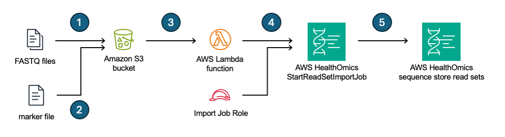

# AWS HealthOmics storage importer

This is a simple CDK app demonstrating an event-driven architecture that automates importing data into AWS HealthOmics sequence stores when objects are created in Amazon S3.

An example use case for this architecture is when customers routinely migrate large quantities (>=10TiB) of raw sequncing data (e.g. FASTQ files) to AWS in batches. Automating import of this data into AWS HealthOmics sequence stores provides customers with low cost, durable, and long-term storage that is purpose-built for genomics datatypes. Using specific events ensures that data is only imported when a sequencing device (or a group of them) is finished generating data.

## Prerequisites

* [AWS CDK](https://docs.aws.amazon.com/cdk/v2/guide/getting_started.html#getting_started_install) and all associated dependencies (like NodeJS)
* An existing Amazon S3 bucket

## What's deployed
* An event configuration on the specified S3 bucket
* An AWS Lambda function that handles creating sequence store import jobs
* An AWS HealthOmics sequence store. You have the option of using a pre-existing one if desired.
* AWS IAM Roles for Lambda function and read set import job permissions

## Configuration

Edit the `cdk.json` file at the root of this project (where this README file is). Under the `context` property add the following attributes:

| attribute | type | required | description |
| :-- | :-- | :-- | :-- |
| `bucketArn` | string | yes | ARN for the bucket that will be used for source data. This can include prefixes restrict scope to a folder in the bucket. Howver, do not include any trailing slashes. Examples: `arn:aws:s3:::my-bucket`, `arn:aws:s3:::my-bucket/my-prefix` |
| `markerFileName` | string | no | Name of the marker file used to trigger HealthOmics read set import jobs. Default: "progress.AWS" |
| `seqStoreArn` | string | no | ARN for the HealthOmics sequence store to import data into. If ommitted, a sequence store will be created. |

An example configuration looks like:
```json
{
  ...
  "context": {
    "bucketArn": "arn:aws:s3:::my-bucket",
    "markerFileName": "progress.AWS",
    "seqStoreArn": "arn:aws:omics:<aws-region>:<aws-account-id>:sequenceStore/<sequence-store-id>",
    ...
  }
}

```

## Setup and deployment

Assuming all prerequisites are satisfied, run the following at the root of this project (where this README file is) to install all NodeJS packages this app depends on:

```bash
npm install
```

Once the above is complete, you can use the AWS CDK to deploy the app using:

```bash
cdk deploy
```

> **NOTE**: you may need elevated (e.g. PowerUser or Administrator) priveleges to your AWS environment to do this.

When the deployment successfully completes you should see something like:

```
OmicsStorageImporterStack: deploying... [1/1]
OmicsStorageImporterStack: creating CloudFormation changeset...

 ✅  OmicsStorageImporterStack

✨  Deployment time: 58.34s

Stack ARN:
arn:aws:cloudformation:us-west-2:111122223333:stack/OmicsStorageImporterStack/4411b180-2418-11ef-87f5-029655f224dd
```

## Usage

The following steps walk through using the deployed app with publicly accessible demonstration data.

1. Copy demo FASTQ files to your S3 bucket into a folder called `omics-storage-importer/flowcell-0000/Lane1`:
   
   ```bash
   AWS_REGION=us-west-2   # <-- change this value to match your environment (e.g. the region you operate in with HealthOmics)
   BUCKET_NAME=my-bucket  # <-- change this value to match your environment
   SOURCE_S3_URI_PREFIX=s3://aws-genomics-static-${AWS_REGION}/omics-data/fastq/ERR194159/downsampled
   TARGET_S3_URI_PREFIX=s3://${BUCKET_NAME}/omics-storage-importer/flowcell-0000/Lane1

   FC_ID=FC-DEMO

   aws s3 cp ${SOURCE_S3_URI_PREFIX}/C0L01ACXX.1.R1.fastq.0.63.gz ${TARGET_S3_URI_PREFIX}/${FC_ID}_SAMPLE1.R1.fastq.gz
   aws s3 cp ${SOURCE_S3_URI_PREFIX}/C0L01ACXX.1.R2.fastq.0.63.gz ${TARGET_S3_URI_PREFIX}/${FC_ID}_SAMPLE1.R2.fastq.gz
   aws s3 cp ${SOURCE_S3_URI_PREFIX}/C0L01ACXX.2.R1.fastq.0.63.gz ${TARGET_S3_URI_PREFIX}/${FC_ID}_SAMPLE2.R1.fastq.gz
   aws s3 cp ${SOURCE_S3_URI_PREFIX}/C0L01ACXX.2.R1.fastq.0.63.gz ${TARGET_S3_URI_PREFIX}/${FC_ID}_SAMPLE2.R2.fastq.gz
   ```

   Files are renamed for simplicity and to align with the naming convention expected by the app which is `FLOWCELL-ID_SAMPLE-ID.R{1,2}.fastq.gz`. The data represents paired reads for two samples.

2. Once the FASTQ upload completes, add a marker file at `s3://${BUCKET_NAME}/omics-storage-importer/flowcell-0000/`. The command below assumes the default marker file of `progress.AWS`.
   
   ```bash
   BUCKET_NAME=my-bucket     # <-- change this value to match your environment
   MARKER_FILE=progress.AWS  # <-- this should match your app configuration
   TARGET_S3_URI_PREFIX=s3://${BUCKET_NAME}/omics-storage-importer/flowcell-0000

   touch ${MARKER_FILE}
   aws s3 cp ${MARKER_FILE} ${TARGET_S3_URI_PREFIX}/${MARKER_FILE}
   ```

3. Navigate to [Sequence stores in the AWS HealthOmics Console](https://console.aws.amazon.com/omics/home#/sequenceStore).
4. Under **Sequence stores** click on the name of the sequence store named "demo-flowcell-data". This will open the details page for the sequence store.
   > **NOTE**: If you configured the app to use a pre-existing sequence store click on the name of that sequence store instead.
5. Click on the "Data transfers" tab. Therein you should see an import job in progress. This was triggered when the `progress.AWS` marker file was uploaded to S3.
6. Click on the ID of the import job in progress. This will take you to the details for the import job. There you should see two FASTQ read sets being imported. Each pair of FASTQs is used to create a read set.

## How it works



1. Users upload FASTQ files to an Amazon S3 bucket (e.g. using AWS DataSync) in folders to group FASTQ data as needed. Each grouping represents one sequencing source type (e.g. DNA or RNA). FASTQ filenames encode their origin - e.g. `<FLOWCELL-ID>_<SAMPLE-ID>.fq.gz`
2. Once all FASTQ uploads have completed a marker file is uploaded. This is placed in the same parent folder as the set of FASTQs uploaded in step 1.
3. The marker file creates an [S3 Event Notification](https://docs.aws.amazon.com/AmazonS3/latest/userguide/EventNotifications.html) that invokes an AWS Lambda function.
4. The Lambda function collects the paths of FASTQ files in the same folder as the trigger file, and creates AWS HealthOmics read set import jobs as needed. Paired FASTQ files are handled accordingly. These import jobs use an IAM role for access to the source FASTQ files.
5. Read set import jobs create read sets in an AWS HealthOmics sequence store.

## Cost
Cost will primarily depend on the amount of data stored in the deployed AWS HealthOmics sequence store, and is based on [AWS HealthOmics pricing](https://aws.amazon.com/healthomics/pricing/). There are no fees for importing data into AWS HealthOmics storage.

Minor costs will come from Lambda function invocations based on [AWS Lambda pricing](https://aws.amazon.com/lambda/pricing/). The deployed Lambda function is x86 based and configured with 128MB of Memory and a timeout of 5min. This has a maximum per invocation cost of:

```
$0.0000000021/ms * 5min * 60s/min * 1000ms/s = $0.00063/invocation
```

If invoked 10 times each day over a 1 mo (30-days) billing period, this will result in a billing charge of:

```
10 * 30 * $0.00063/invocation = $0.189
```

## Cleanup

If you used the default configuration, where the app created a HealthOmics sequence store named `demo-flowcell-data`, you will need to manually delete all data from it to proceed. To do this:

1. Navigate to [Sequence stores in the AWS HealthOmics Console](https://console.aws.amazon.com/omics/home#/sequenceStore).
2. Under **Sequence stores** click on the name of the sequence store named "demo-flowcell-data". This will open the details page for the sequence store.
3. Under the **Read sets** tab, select all read sets using the checkbox in the column header.
4. Click on the **Delete** button.
5. Type "confirm" in the confirmation followed by clicking the **Delete** button in the dialog that appears.


To remove remaining deployed resources run the following at the root of this project (where this README file is):

```bash
cdk destroy
```

No data in S3 is deleted during this operation.
